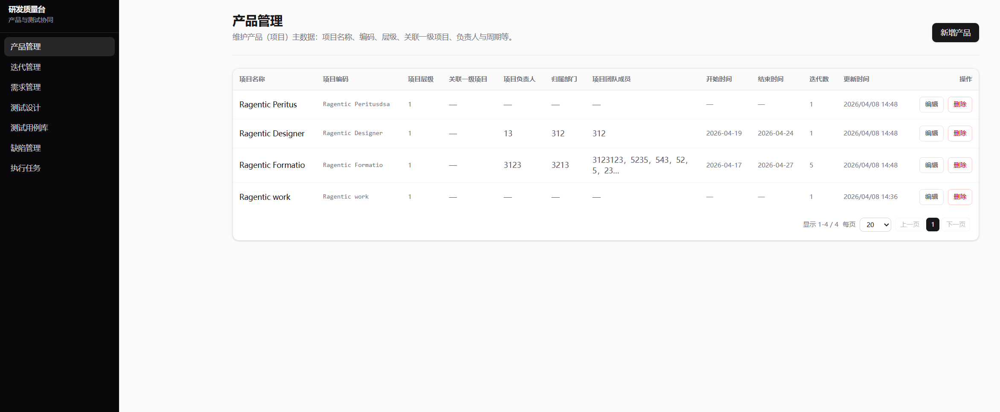
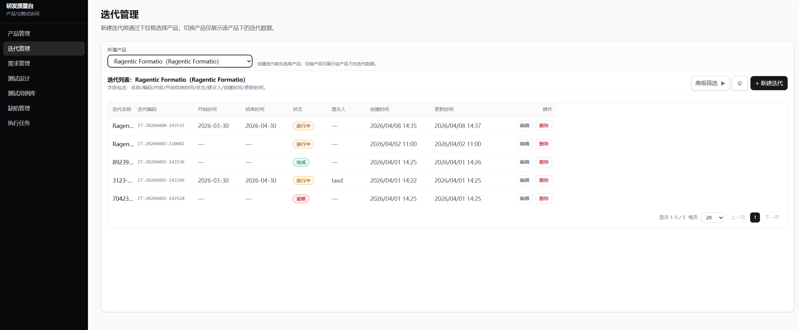
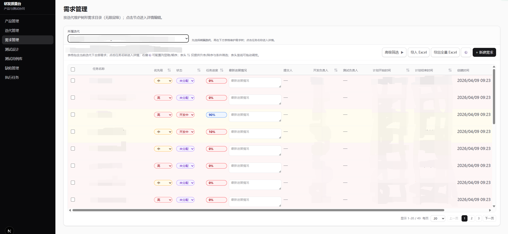
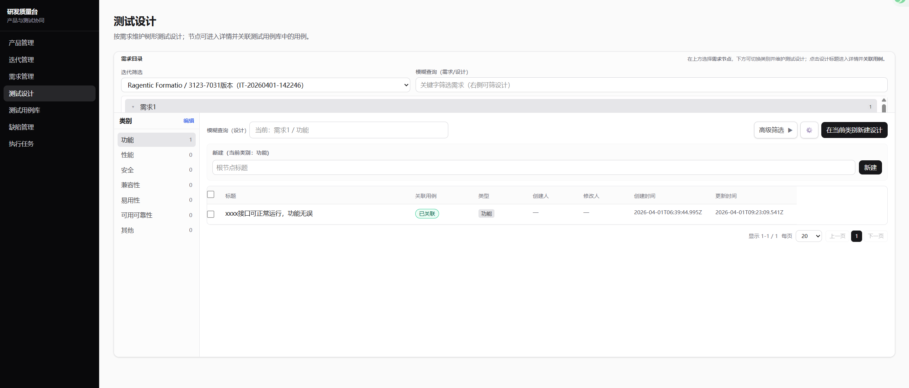
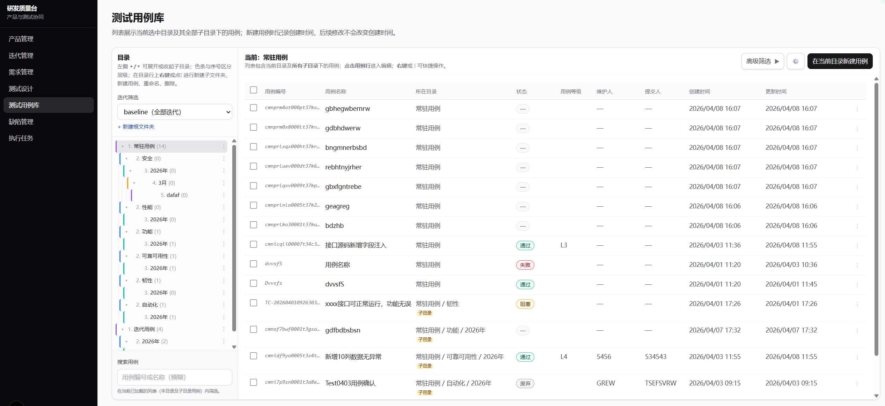

# 研发质量台（Product Management）

一个用于**产品/迭代/需求/测试**协同管理的 Web 应用，覆盖需求树、测试设计、用例库、缺陷管理与执行任务等核心流程。

## 功能总览

## 界面截图

将截图放到 `docs/screenshots/` 目录（推荐 PNG），命名按下列约定。README 会自动展示每个界面一张图。

- 建议分辨率：1440×900 或 1920×1080
- 建议命名：全小写、用 `-` 连接

### 产品管理


### 迭代管理


### 需求管理（需求树）


### 需求节点详情


### 测试设计


### 测试设计节点详情


### 测试用例库


### 缺陷管理


### 执行任务（列表）


### 执行任务（详情）


### 产品管理
- 维护产品列表（创建、查看）。

### 迭代管理
- 在产品下创建/维护迭代。
- 作为各模块数据的统一归属与筛选维度。

### 需求管理（需求树）
- 按迭代维护**树形需求目录（无限层级）**，支持展开/收起。
- 行内快速编辑：**优先级、状态、任务进度、最新进展**。
- **列设置**：显隐/顺序、拖拽列宽。
- **分页**：分页栏位于表格滚动区外侧底部，避免与横向滚动混在一起。
- **高级筛选**：名称、状态、优先级、提交/开发/测试负责人、创建/更新时间等。
- **表头筛选/排序**（⇅ 菜单）：升序/降序 + 条件筛选（如优先级多选、状态多选、任务进度区间、计划起止时间、开发负责人模糊搜索等）。
- **导入/导出**：
  - 导入 Excel（`.xlsx/.xls`）或兼容 CSV
  - 导出当前迭代全量 Excel、按选择批量导出
- **节点详情页**：
  - 编辑详情字段、查看操作日志、附件管理
  - 从详情页「← 返回需求树」会回到列表并**定位到对应节点**

### 测试设计
- 按迭代维护树形测试设计列表，支持列宽调整、分页栏与滚动区分离。
- 设计节点详情页：编辑/查看节点信息（与需求挂载逻辑一致）。

### 测试用例库
- 左侧目录树 + 右侧用例列表（支持拖动调整左侧宽度）。
- 用例列表支持列设置、列宽拖拽、分页栏与表格横向滚动区分离。
- 右侧列表区域使用内部滚动容器，避免整页滚动干扰。

### 缺陷管理
- 缺陷列表维护，支持列设置、列宽拖拽、分页栏与滚动区分离。

### 执行任务
- 按迭代维护执行任务树（支持树形层级、列宽拖拽）。
- 列表区为独立滚动容器，分页固定在表格外侧底部。
- 进入任务详情后，可从用例库导入用例并查看已导入列表（含可调列宽）。

### 进度与状态自动校验（需求）
- 当任务进度可解析为 0–100% 时自动校验状态：
  - \(0 < 进度 < 100\) → **开发中**
  - \(进度 = 100\) → **待验证**
  - 空/0/不可解析 → **不自动改状态**
- 在以下场景生效：列表行内编辑、详情保存、导入。

## 技术栈
- Next.js（App Router）
- React
- TypeScript
- Tailwind CSS
- Prisma
- XLSX（Excel 导入/导出）

## 本地运行

### 1) 安装依赖

```bash
npm install
```

### 2) 配置环境变量
- 复制 `.env.example` 为 `.env` 并按需修改：

```bash
cp .env.example .env
```

默认使用 SQLite：
- `.env.example` 中 `DATABASE_URL="file:./dev.db"`

### 3) 初始化数据库（SQLite 默认）

```bash
npm run db:push
```

（首次安装后 `postinstall` 会自动执行 `prisma generate`；如遇到 Prisma Client 相关报错，可手动运行 `npm run db:generate`。）

### 4) 启动开发服务

```bash
npm run dev
```

如端口占用可用：

```bash
npm run dev:once
```

## 数据与安全（不会推送到 GitHub 的内容）
- **`.env`**：已在 `.gitignore` 中忽略，不会被提交/推送。
- **本地数据库文件**（SQLite）：`.gitignore` 已忽略 `prisma/*.db`、`prisma/*.db-journal`，不会被提交/推送。

## 常见问题

### 数据库结构与程序不一致
若提示数据库缺字段/结构不同步，请在项目根目录执行：

```bash
npm run db:push
```

必要时重启开发服务；若 Prisma Client 版本/生成物不一致，可执行：

```bash
npm run db:generate
```

